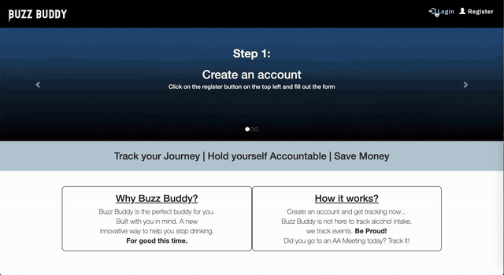
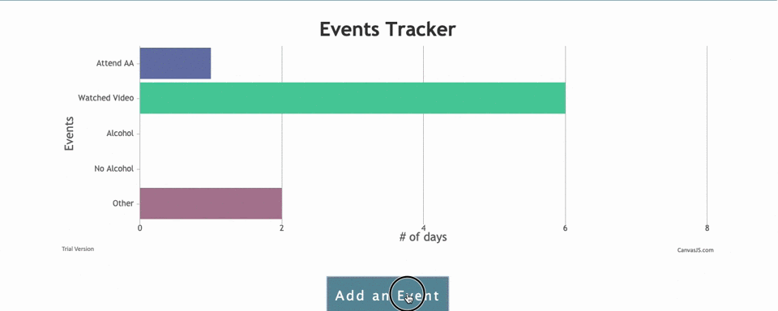
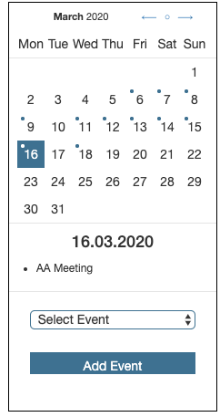
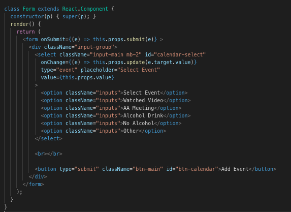
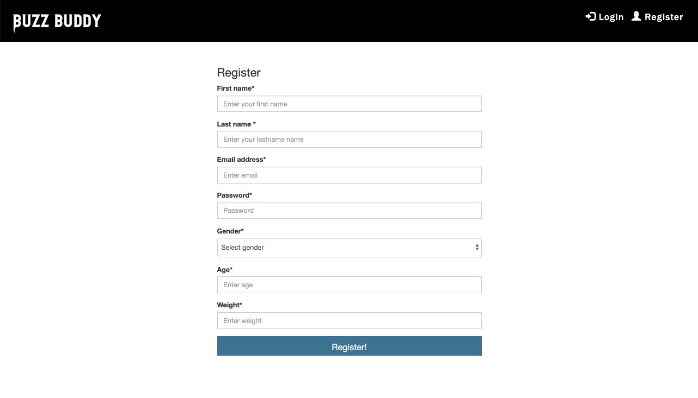

#   Buzz Buddy 

https://buzzbuddy.herokuapp.com/

**Default login**

username: `demo@demo.com`
password: `demo`

## **Description**

Buzz Buddy is an interactive event tracking app with resources that help you stop drinking alcohol. The app is designed with the user in mind, given you access to keep track of events and display the data for you. 

## **Live Demo**

## **Features**

### ChartJS

React component from CanvasJS. Makes a POST request to the database to retrieve all events for a specific user. Tracks the number of days for each event.

 

### React Calendar
React Component used to add events. Makes POST requests to add and remove events to and from the database. 

 

### Validation

Validation is used in several ways, specifically in the login and register. Making sure that all feilds are filled in with the correct format. There is also a validation for age, users must be 21+ to use the site.

## **Technolgies Used**

* Bootstrap
* React Calendar
* ChartJS
* CSS
* Git
* Node Package Managers (NPM)
    * express 
    * body-parser 
    * path
    * mongoose
    * jsonwebtoken
    * bcrypt
    * dotenv

## **Future Development**

* Add more resources
* Update chart

## **Contributors**
 - Links to our Githubs
    - [Chris Hayashi](https://github.com/Chris-Hayashi)
    - [Dimple Shanbhag](https://github.com/dimz13)
    - [Shelby Reinsimar](https://github.com/shelbyreins)

